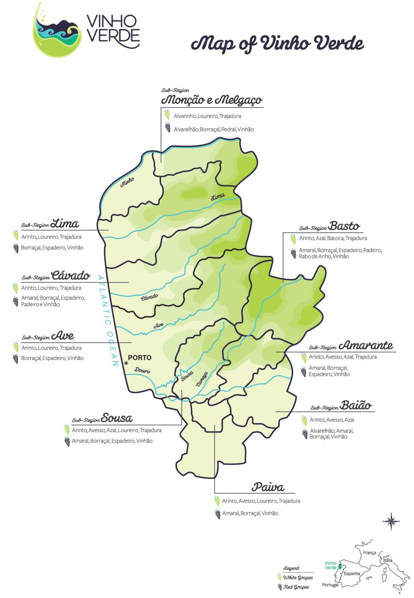

```{r global_options, include=FALSE}
library(ggplot2)
library(formatR)
library(dplyr)
library(gplots)
library(RColorBrewer)
library(GGally)
library(gridExtra)

theme_set(theme_bw())
knitr::opts_chunk$set(fig.width=12, fig.height=8,
                      echo=FALSE, warning=FALSE, message=FALSE,
                      kfigr.link = TRUE, tidy.opts=list(blank=FALSE, 
                      width.cutoff=40))

```

# What is Vinho Verde?

The data set, from 2008, is comprised of white wines known as *Vinho Verde* (green wine). *Vinho Verde* (VV) refers to the Minho region of northern Portugal; it is not a type of grape. This region is known for being cooler and wetter than the rest of the country in the winter, although it does get hot in the summer.

VV wines have traditionally been known for being light, crisp and low in alchohol, and were meant to be drunk young (when they're "green"). Lately, however, VV's reputation of being a cheap & cheerful wine has begun to change.

Within this region, there are nine sub-regions.



As you can see from the map, the topgraphy of the VV region is varied, as well as for several of its subregions. Vinho verde wines can come from the Atlantic coast, the mountains, or inland plains. Soils vary, as do the type of grapes grown.

# About the data

```{r create df}
whites <- read.csv('wineQualityWhites.csv')
```

How large is this data set?

```{r df info}
dim(whites)
names(whites)
str(whites)
```

The data is either integer or numeric. 

Alas, none of the categorical information mentioned above, such as soil type, grape variety, or subregion, is included in this data set.

Since we need at least one categorical variable for this dataset, let's convert `quality`.

```{r, create category var}
whites$quality <-factor(whites$quality)
levels(whites$quality)
```

```{r df summary}

summary(whites)

```

There are no NA values. Only `citric.acid` has zero values. The scale of values varies from the 100s for `total.sulfur.dioxide` to 1000th decimal place for `chlorides`.

#Univariate plots

The first thing I wanted to look at was the quality. 

## `quality`

```{r quality summary}

summary((whites$quality))
qplot(quality, data=whites, fill=I('lightgreen'))

```

Most wines are average: `r round(nrow(subset(whites, quality==5 | quality==6))/nrow(whites),3) * 100`% of wines earned a score of 5 or 6. 

By contrast, only:

* `r nrow(subset(whites, quality==9))` wines earned a "9"
* `r nrow(subset(whites, quality==3))` wines earned a "3"

## `alcohol`

```{r alcohol dist, fig.show='hide'}

p.a <- ggplot(aes(x=alcohol, y=..density..), data=whites)

p.a + geom_histogram(binwidth=.5, fill=I('lightgreen'))

p.a + geom_histogram(binwidth=.4, fill=I('lightgreen'))

```

```{r alcohol summary}

summary(whites$alcohol)

p.a + geom_histogram(binwidth=.2, fill=I('lightgreen')) +
  geom_density() + 
  geom_vline(xintercept = median(whites$alcohol), 
             linetype = 2, color = 'blue') + 
  geom_vline(xintercept = mean(whites$alcohol), 
             linetype = 3, color = 'blue')

```

Alcohol content ranges from `r min(whites$alcohol)` to `r max(whites$alcohol)`% by volume. 

The distribution looks unusual, not just bimodal but multimodal. 
The main mode is at 9.5%, but there are smaller, 'local' modes at 10.5% and 12% as well. 

**Dip at 11.5%** 

Regardless of binwidth, there was a clear dip at 11.5%. Why?
Here is the likely explanation (it also explains the modes, max and min values):

> The alcohol level of ‘generic’ Vinho Verde must lie between 8% and 11.5% ABV.  However, if the wine is labelled with one of the nine sub-regions, which specialise in particular grape varieties, the range extends from 9% to 14% ABV.  Additionally, Vinho Verde made from the single varietal Alvarinho can be between 11.5% and 14% ABV. 
  -https://www.alcoholprofessor.com/blog/2014/04/23/vinho-verde-a-splash-of-summer-vinous-joy/ 

**Are alcohol values continuous or discrete?** 

```{r alcohol bar chart, echo=TRUE}

ggplot(aes(alcohol), data=whites) +
  geom_bar(color=I('green')) + 
  scale_x_continuous(breaks=seq(8,14.5,.5))

```

Alcohol content % is usually listed to the 10th of a percentage point. Round numbers, and .5 are more common than others.

## `fixed.acidity`

> In wine tasting, the term “acidity” refers to the fresh, tart and sour attributes of the wine which are evaluated in relation to how well the acidity balances out the sweetness and bitter components of the wine such as tannins. Three primary acids are found in wine grapes: tartaric, malic and citric acids. — http://winemaking.jackkeller.net/acid.asp

`fixed.acidity` in our data set only refers to tartaric acid, the most predominant acid in wine. It helps stabilize a wine's chemical make-up and its colour. It also contributes to taste. 

It is measured in g/dm^3, which is a more scientific notation for g/l. Multiply this value by 0.1 to calculate the % by volume.

How to intrepret fixed acidity values: 

* .4% (4g/l) is considered flat
* 1% (10g/l) FA is considered too tart to be drinkable.
* Most table wine is between 0.6 to 0.7%.

```{r fixed.acidity summary}

summary(whites$fixed.acidity)

qplot(fixed.acidity, data=whites, 
      fill=I('greenyellow'),color=I('white'), 
      binwidth=.3) +
      scale_x_continuous(breaks=seq(3,14,1)) 

```

`fixed.acidity` has a very slight negative but it is hard to see clearly on this plot. There seems to be some negative outliers too.

Let's try a boxplot instead that also shows the underlying points.

```{r fixed.acidity boxplot with points}

ggplot(aes(x="1", y=fixed.acidity), data=whites) +
  geom_boxplot(width=0.5, alpha=0.8) + 
  geom_point(position=position_jitter(width=0.4), 
             alpha=0.2, color='greenyellow') 

```


Indeed, there are both negative and positive outliers, but more positive ones and they also extend further. Call this a near-normal distribution.

**Do these wines have a higher fixed acidity, in general?**

Let's call this a normal distribution and calculate +/- 1 standard deviation to see where most fixed acidity values fall.

```{r fixed.acidity range, echo=TRUE}

fa.sd <- sd(whites$fixed.acidity)
top <- median(whites$fixed.acidity) + fa.sd
bottom <- median(whites$fixed.acidity) - fa.sd

```

~68% of `fixed.acidity` values fall between `r bottom * 0.1` to `r top * 0.1`%. In other words, the upper value of the range is slightly higher than normal for white wines.

##`volatile.acidity`

Volatile acidity (VA) is primarily a measure of the presence of acetic acid. While a small amount is a natural by-product of fermentation, exposure to oxygen converts alcohol to acetic acid, which is known as oxidization. Too much acetic acid creates a vinegar taste in wine. 

A VA of 0.03-0.06% is produced during fermentation and is considered a normal level. 
(source: http://www.wineperspective.com/the_acidity_of_wine.htm)

Since `volatile.acidity` is in g/l, multiply the values by 0.1 to calculate the %.

```{r volatile.acidity summary}

summary(whites$volatile.acidity)

qplot(volatile.acidity, data=whites, 
      fill=I('greenyellow'), 
      binwidth=.02)

```

The distribution is negatively skewed. Let's transform the x-axis to have a better look at the long tail values.

```{r volatile.acidity log10}

qplot(volatile.acidity, data=whites, 
      binwidth=.005, 
      fill=I('greenyellow')) + 
      scale_x_log10(breaks=seq(0,1,.1))

```

While most of values are less than 0.03%, there are quite a few outliers above 0.06%, with the highest reaching `r max(whites$volatile.acidity) * 0.1`%.

##`citric.acid`


```{r citric.acid summary}

summary(whites$citric.acid)

qplot(citric.acid, data=whites, 
      binwidth=.02, 
      fill=I('greenyellow'))

```

The distribution for `citric acid` is normal with fewer positive outliers compared to the previous phytochemicals examined.

After reducing the binwidth I noticed some strange spikes at 0, 0.5 and 0.7g/l, and even at 1g/l.

Here is a possible explanation: 

> In the European Union, use of citric acid for acidification is prohibited, but limited use of citric acid is permitted for removing excess iron and copper from the wine if potassium ferrocyanide is not available. — https://en.wikipedia.org/wiki/Acids_in_wine#Citric_acid

And this is from a 2003 export agreement between Canada and the EU:

> 15. addition of citric acid for wine stabilisation purposes, provided that the final content in the treated wine does not exceed 1 g/l, — http://eur-lex.europa.eu/legal-content/EN/TXT/?uri=CELEX:52003PC0377 (section B, item 15)

##`pH`

This is a test of how strong the acidity is. Wines typically have a pH between 2.9 and 3.9.
The lower the pH, the more acidic (instead of basic) the wine.

```{r pH summary}

summary(whites$pH)

#pH:Perfectly normal!
qplot(pH, data=whites, binwidth=.05, fill=I('turquoise')) +
  scale_x_continuous(breaks=seq(2,4.5,.25)) 

```

In this dataset `pH`'s distribution is a near-perfect bell curve. 

The entire range of `pH` values is from `r min(whites$pH)` to `r max(whites$pH)`, so veers slightly more than usual to the acidic end of the wine pH spectrum.

##`chlorides`

> In most wines, the chloride concentration is below 50mg/l, expressed in sodium chloride. It may exceed 1g/l in wine made from grapes grown by the sea.

> Sodium chloride is sometimes added during fining, especially when egg whites are used.- [Handbook of Enology, The Chemistry of Wine: Stabilization and Treatments](https://books.google.fr/books?id=a03C-aFy2jsC&pg=PA94&lpg=PA94&dq=adding+sodium+chloride+to+wine&source=bl&ots=pAoGDmfuTl&sig=AqMfDCikyNKXX__SWzFgWuvam5o&hl=en&sa=X&ved=0ahUKEwjfy4rx9KHLAhUGcHIKHZxSATcQ6AEIMTAD#v=onepage&q=adding%20sodium%20chloride%20to%20wine&f=false)


```{r chlorides summary}

summary(whites$chlorides)

qplot(chlorides, data=whites, binwidth=.002, fill=I('turquoise'))

```

Negatively skewed with a particularly long tail. 

```{r chloride log10}

#look at that long tail
qplot(chlorides, data=whites, binwidth=.001, fill=I('turquoise')) +
  scale_x_log10()

```

Not much more info here. Will try a boxplot.

```{r chlorides boxplot}

ggplot(aes(x="1", y=chlorides), data=whites) +
  geom_boxplot(width=0.5, alpha=0.8) + 
  geom_point(position=position_jitter(width=0.4), 
             alpha=0.2, color='turquoise') 

```

Transforming the x-axis to log10 shows that choloride values are discrete that beome continuous as chloride levels reach 0.3 g/l (300 mg/l) and a bit beyond. This is higher than normal, but still a far cry from 1 g/l.

I suspect the region's notorious rain and mist in wintertime results in higher than usual salinity in the soil of coastal subregions, which is then absorbed by the grapes. 

##Density

Density is what makes wine feel full-bodied. Since VV wines are known for their lightness, I'd expect this dataset to be lower-density than your typical white wine dataset (if I had any to compare it to).

Higher density in wine is usually a result of higher sugar or higher alcohol content. 

```{r}

summary(whites$density)

#D: similar to sugar, extreme pos outlier
  qplot(density, data=whites, binwidth=.0005)

```

Not suprisingly, since it's related to sugar & alcohol, `density`'s distribution is a bit lumpy, but less than for `residual.sugar` and `alcohol`. It also has two extreme positive outliers, just like `residual.sugar`.

```{r}

qplot(density, data=whites, binwidth=.0001) + 
  scale_x_log10()

```

This doesn't help much.

##`residual.sugar`

Residual sugar, or lack thereof, in wines can be a sign of a flaw - secondary fermentation. For VV wines, this is considered a feature rather than a flaw.

> Outside of Champagne, secondary fermentation in the bottle is a serious problem for winemakers, and one that calls for careful precautions. Besides generating an unpleasant effervescence (bubbly isn’t always better, hate to say), the secondary fermentation cuts into the residual sugars and unbalances the wine. But it’s even worse when the dormant yeast wakes up and starts eating up the acids in the wine.

> This is called malolactic fermentation, and if it sounds familiar it’s because it is what gives new world Chardonnay that creamy, buttered-toast flavor. Unwanted malo is usually a serious concern, especially in white wines that rely on acidity for balance and texture, but the winemakers in Minho found that the ensuing slight fizziness caused by this flaw actually made the wine more palatable.-[badass-sommelier-lets-drink-some-vinho-verde](http://birthmoviesdeath.com/2013/08/16/badass-sommelier-lets-drink-some-vinho-verde)

```{r residual.sugar summary}

summary(whites$residual.sugar)

qplot(residual.sugar, data=whites, binwidth=1, fill=I('pink')) +
  scale_x_continuous(limits=c(0,25), breaks=seq(0,25,5))

```

This distribution looks like a swan, where the dramatic mode around 2 is the neck and then a lumpy tail as its body.

Let's look at this using a log10 x-axis.

```{r residual.sugar log10 plots}

ggplot(aes(x=residual.sugar, y=..density..), data=whites) + 
  geom_histogram(binwidth=.05, fill='pink', colour='white') +
  geom_density(color='blue') +
  scale_x_log10(breaks=seq(0,60,5))

```

There are a few extreme outliers above 20. The distribution now looks like a camel: it has two humps. Are there two populations within this data set?

If we subset the dataset by `residual.sugar` value, will it also change the other odd-looking distributions, those for `alcohol` and `density`?

```{r low residual.sugar, echo=TRUE}

whites.dry <- whites %>%
  filter(residual.sugar <= 3)

nrow(whites.dry)

qplot(residual.sugar, data=whites.dry, binwidth=0.2, fill=I('pink'))

```

How did this change the distribution for `quality`, `alcohol`, and `density`?

```{r whites.dry distributions, fig.height=4, fig.width=12}

# converting quaity to numeric earlier reduced each val by 2
p1 <- qplot(as.factor(quality), data=whites.dry) 

p2 <- qplot(alcohol, data=whites.dry, binwidth=0.3) 

p3 <- qplot(density, data=whites.dry)

grid.arrange(p1, p2, p3, nrow=1)

```

For drier VV wines, the distributions for `alcohol` and `density` look considerably closer to a normal distribution. Even `quality`'s distribution looks more symmetric.

Now for the sweeter wines:

```{r higher residual.sugar, echo=TRUE}

whites.sweet <- whites %>%
  filter(residual.sugar > 3)

nrow(whites.sweet)

qplot(residual.sugar, data=whites.sweet, binwidth=1, fill=I('pink'))

qplot(residual.sugar, data=whites.sweet, binwidth=1, 
      fill=I('pink'), color=I('white')) +
      scale_x_continuous(limits=c(0,25))

```

```{r whites.sweet distributions, fig.height=4, fig.width=12}

# converting quaity to numeric earlier reduced each val by 2
p1 <- qplot(as.factor(quality), data=whites.sweet) 

p2 <- qplot(alcohol, data=whites.sweet, binwidth=0.3) 

p3 <- qplot(density, data=whites.sweet)

grid.arrange(p1, p2, p3, nrow=1)

```

As seen in `whites.dry`, the distribution for `quality` looks even more symmetric than for the full dataset. The shape of distributions for `alcohol` and `density`, on the other hand, look virtually identical to those of the full dataset.


# Univariate analysis

##What is the structure of your dataset?

There are `r nrow(whites)` rows, and `r dim(whites)[2]` variables.
All variables are numeric. In order to have at least one categorical variable, I converted `quality` to a factor with 7 levels.

Most wine is of average quality, a 5 or a 6. The mean `quality` score is `r mean(as.integer(whites$quality)) + 2`.

`alcohol`ranges from `r min(whites$alcohol)` to `r max(whites$alcohol)`%. The most common alcohol content is 9.5%, but the median is `r median(whites$alcohol)`, very close to the mean is `r mean(whites$alcohol)`.

Wine with a residual sugar content greater than 45 is considered sweet. Only one wine in the dataset would therefore be considered sweet. It had the maximum value of `r max(whites$residual.sugar)`g. Most wines are far below this. Average `residual.sugar` content is `r mean(whites$residual.sugar)`g, while the median is a considerably lower `r median(whites$residual.sugar)`g.


##What is/are the main feature(s) of interest in your dataset?

The main feature I'm interested in are `alcohol`. The VV wine's alcohol content determines how specific a region can be used on its label. Usually, the more specific the location of the wine, the higher the price it commands.

* Generic VV wines is between 8% and 11.5%
* VV wine from one of the subregions (i.e. which limits which grape varieties are used in its wines) is between 9% and 14%.
* Single-varietal Alvarinho is between 11.5% and 14%.

I suspect as the region/varietal becomes more specific, its quality will go up.

The other key feature is `residual.sugar`. It plays a major part in flavour and density. Lower values could indicate secondary fermentation, which could either mean a wine that is pleasantly fizzy, or one that is more round and buttery instead of sharper and acidic. Or else it could be that it's failed to achieve either and is simply unbalanced. 

`Chlorides` is of interest, because several VV wine reviews I read online spoke, in positive terms, of VV wines with noticeable hints of salt. This seems strange, but in my research I've learned that sodium chloride in wine (as opposite to other forms of sodium) creates a soapy taste in wine. While this doesn't sound appealing, it's true salt is often used to contrast sweetness in chocolate and caramel.

More relevant to the data at hand, I've myself noticed a pleasantly and very subtle salty flavour to Txakoli wine, which has been compared to VV as it's from Spanish Basque country, a similarly lush, wet region by the Atlantic. 

Lastly, `fixed.acidity` is of interest because one of the classic ways to describe a wine is "a nice balance of sweetness and acidity" or else a "nice balance of alcohol and acidity". Also, these are considered green wines: youthful, sharp, clean. All features I tend to associate with more acidity.

##What other features in the dataset do you think will help support your investigation into your feature(s) of interest?

* `density`, because it provides the body, or "mouthfeel" for wine, which is also something you often hear discussed in wine reviews. It is also strongly related to sugar and alcohol.

* higher values of `volatile.acidity` could indicate wines that have oxidized and so help identify lower-quality wines.

##Did you create any new variables from existing variables in the dataset?

Nope.

##Of the features you investigated, were there any unusual distributions? Did you perform any operations on the data to tidy, adjust, or change the form of the data? If so, why did you do this?

Yes: `residual.sugar` and `alcohol`, and to a lesser extent, `density`. 

Tranforming `residual.sugar` with log10 revealed a bimodal distribution with a mode at 2, and another mode around 10. The second mode is harder to read. The density plot actually shows two bumps on this second mode. 

To see if these represented two distinct wine populations within the dataset, I created two subsets, `whites.dry` and `whites.sweet`, with a `residual.sugar` value of 3g being the dividing line. 

When I replotted the distributions for some key variables, those for `whites.dry` appeared more symmetrical than in the full dataset. Those for `whites.sweet`, however, didn't noticeably change shape.

I would like to compare the correlations for the full dataset and the two subsets.

#Bivariate plots

Which variables have the highest correlation with `quality`?

##Correlations

First we'll need to create samples of each of the datasets.

```{r prep for ggpairs, echo=TRUE}

# whites

whites.subset <- subset(whites,select=-X) #improve readability
whites.subset$quality <- as.numeric(whites.subset$quality) #to get correlation

# create sample so it's faster to run
set.seed(888)
whites_samp <- whites.subset[sample(1:nrow(whites.subset), 1000), ]

# whites.dry

whites.dry <- subset(whites.dry, select=-X)
whites.dry$quality <- as.numeric(whites.dry$quality)

set.seed(888)
whites.dry_samp <- whites.dry[sample(1:nrow(whites.dry),1000),]

# whites.sweet

whites.sweet <- subset(whites.sweet, select=-X) #improve readability
whites.sweet$quality <- as.numeric(whites.sweet$quality)

set.seed(888)
whites.sweet_samp <- whites.sweet[sample(1:nrow(whites.sweet),1000),]

```

###Correlation matrix for `whites`

```{r whites ggpairs, echo=TRUE}

ggpairs(whites_samp, axisLabels = 'internal',
        lower = list(continuous = wrap("smooth", alpha=0.2, shape = I('.'), color='green')), 
        upper = list(combo = wrap("box", outlier.shape = I('.'))))

```


The 3 attributes with the highest correlations with `quality` are:

* `alcohol`: `r with(whites_samp, cor(alcohol,quality))`
* `density`: `r with(whites_samp, cor(density,quality))`
* `chlorides`: `r with(whites_samp, cor(chlorides,quality))`

###Correlation matrix for `whites.dry`

```{r whites.dry ggpairs}

ggpairs(whites.dry_samp, axisLabels = "internal",
        lower = list(continuous = wrap("smooth", alpha=0.2, shape = I('.'), color='blue')),
        upper = list(combo = wrap("box", outlier.shape = I('.'))))

```

The strongest `quality` correlations for `whites.dry` are:

* `alcohol`: `r with(whites.dry_samp, cor(alcohol,quality))`
* `density`: `r with(whites.dry_samp, cor(density,quality))`
* `volatile.acidity`: `r with(whites.dry_samp, cor(volatile.acidity,quality))`
* `residual.sugar`: `r with(whites.dry_samp, cor(residual.sugar,quality))`

While `alcohol`'s correlation is only slightly lower, `density`'s negative correlation has gotten stronger. The biggest change is that drier VV wines, `volatile.acidity` and `residual.sugar` have relatively high positive correlations as well. In the full dataset, the third & fourth strongest correlations were `chlorides` and `total.sulfur.dioxide` (which was only -.17).

This is especially notably for `residual.sugar`, since it had a very low _negative_ correlation with `quality` in the full dataset. 

###Correlation matrix for `whites.sweet`

```{r whites.sweet ggpairs}

ggpairs(whites.sweet_samp, axisLabels = "internal",
        lower = list(continuous = wrap("smooth", alpha=0.2, shape = I('.'), color='red')),
        upper = list(combo = wrap("box", outlier.shape = I('.'))))

```

For `whites.sweet`, the strongest `quality` correlations are:

* `alcohol`: `r with(whites.sweet_samp, cor(alcohol,quality))`
* `density`: `r with(whites.sweet_samp, cor(density,quality))`
* `chlorides`: `r with(whites.sweet_samp, cor(chlorides,quality))`
* `total.sulfur.dioxide`: `r with(whites.sweet_samp, cor(total.sulfur.dioxide,quality))`

These are also the same top 4 correlating variables with the full `whites` data frames, which is not surprising considering the shape of the distributions for alcohol, density, residual.sugar, and quality are virtually identical for `whites` and `whites.sweet`. 

## So which dataset do I use for the rest of the analysis?

TBD. 

Ideally, I would like to use `whites.dry`. I suspect the improved correlation for `density` and `chlorides` might be due to the extreme positive outliers having more weight in this subset. In `whites.dry` by we lost all the positive outliers for `residual.sugar` and the closely-related `density` (and perhaps for others too).


