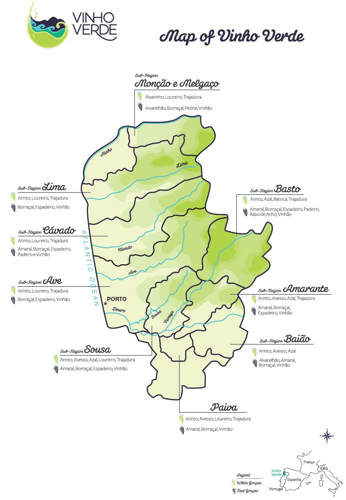

Exploring Vinho Verde wines by Sarah Hosking
========================================================

> **Tip**: You will see quoted sections like this throughout the template to
help you construct your report. Make sure that you remove these notes before
you finish and submit your project!

> **Tip**: One of the requirements of this project is that your code follows
good formatting techniques, including limiting your lines to 80 characters or
less. If you're using RStudio, go into Preferences \> Code \> Display to set up
a margin line to help you keep track of this guideline!

```{r echo=FALSE, message=FALSE, warning=FALSE, packages}
# Load all of the packages that you end up using in your analysis in this code
# chunk.

# Notice that the parameter "echo" was set to FALSE for this code chunk. This
# prevents the code from displaying in the knitted HTML output. You should set
# echo=FALSE for all code chunks in your file, unless it makes sense for your
# report to show the code that generated a particular plot.

# The other parameters for "message" and "warning" should also be set to FALSE
# for other code chunks once you have verified that each plot comes out as you
# want it to. This will clean up the flow of your report.

library(tidyverse)
library(ggplot2)
library(formatR)
library(dplyr)
library(ggplot2)
library(RColorBrewer)
library(GGally)
library(gridExtra)
#library(memisc)

theme_set(theme_bw())
knitr::opts_chunk$set(fig.width=12, fig.height=8,
                      echo=FALSE, warning=FALSE, message=FALSE,
                      kfigr.link = TRUE, tidy.opts=list(blank=FALSE, 
                      width.cutoff=40))
```

# What is Vinho Verde?

The data set, from 2008, is comprised of white wines known as *Vinho Verde* (green wine). *Vinho Verde* (VV) refers to the Minho region of northern Portugal; it is not a type of grape. This region is known for being cooler and wetter than the rest of the country in the winter, although it does get hot in the summer.

VV wines have traditionally been known for being light, crisp and low in alchohol, and were meant to be drunk young (when they're "green"). Lately, however, VV's reputation of being a cheap & cheerful wine has begun to change.

Within this region, there are nine sub-regions.



As you can see from the map, the topgraphy of the VV region is varied, as well as for several of its subregions. Vinho verde wines can come from the Atlantic coast, the mountains, or inland plains. Soils vary, as do the type of grapes grown.

```{r echo=FALSE, Load_the_Data}
# Load the Data

whites <- read.csv('wineQualityWhites.csv')
head(whites)

```


# Univariate Plots Section

> **Tip**: In this section, you should perform some preliminary exploration of
your dataset. Run some summaries of the data and create univariate plots to
understand the structure of the individual variables in your dataset. Don't
forget to add a comment after each plot or closely-related group of plots!
There should be multiple code chunks and text sections; the first one below is
just to help you get started.

How large is this data set?

```{r echo=FALSE, Univariate_Plots}

dim(whites)

```

What are the variable names?

```{r}

names(whites)

```
Let's see the underlying structure of the data.

```{r}

str(whites)

```

The data is either integer or numeric. 

Alas, none of the categorical information mentioned above, such as soil type, grape variety, or subregion, is included in this data set.

Since we need at least one categorical variable for this dataset, let's convert `quality`.

```{r, create category var}

whites$quality <-factor(whites$quality)
levels(whites$quality)

```

```{r df summary}

summary(whites)

```

There are no NA values. Only `citric.acid` has zero values. The scale of values varies from the 100s for `total.sulfur.dioxide` to 1000th decimal place for `chlorides`.

Let's see how many of each quality level?

```{r quality_count}

summary((whites$quality))
qplot(quality, data=whites)


```

```{r quality_counts}

summary(whites$quality)

```
A normal distribution: lots of mediocre wines with few low-quality and even fewer high-quality wines.

Now I'd like to look at distributions, but first need to convert the df to long format.

```{r convert_to_long}


whites.tidy <- whites %>% 
  gather(fixed.acidity, volatile.acidity, citric.acid, residual.sugar, 
         chlorides, free.sulfur.dioxide, total.sulfur.dioxide, density,
         pH, sulphates, alcohol,
         key = 'component', value = 'value', 
         na.rm = TRUE) %>% 
  group_by(quality) %>% 
  arrange(quality)

whites.tidy <- data.frame(whites.tidy)
str(whites.tidy)

```

```{r view_whites_tidy}

head(whites.tidy)

```

Ok, now we're ready to plot histograms.

```{r plot_hists}

p.tidy <- ggplot(data = whites.tidy, aes(x = value))


# add geom layer
hg <- p.tidy + geom_histogram()

# assign facet wrap to a variable
# & fix ranges for x-axes
fw <- facet_wrap(~component, scales = 'free_x')
hg + fw

```

Aside from `pH`, most variables have a moderate negative skew. `residual.sugar` has a pronounced negative skew. `alcohol` has a strangely flat shape.

What will a log-transform yield?

```{r log_transform}

hg + fw + 
  scale_x_log10()

```

Log10 transform of `residual.sugar` is bimodal. Perhaps there are two distinct wine populations in the  dataset? `alcohol` still is strangely flat.

```{r boxplots}
p.tidy <- p.tidy %+% aes(group=component, y = value)

# add boxplot & facet layers
bp <- p.tidy + 
  geom_boxplot(alpha = 0.1)

# update fw var to free y-axis!
fw <- facet_wrap(~component, scales = 'free')

# try again
bp + fw
```
The only variable without positive outliers is `alcohol`. `chlorides` and `citric.acid` seem to have a high number of positive outliers. The `density` and `residual.sugar` outliers look similar.

Are any of the outliers occuring for the same row?

```{r max_vals}
# Do these extreme outliers belong to the same row?

colMaxIdx <- function(data) sapply(data, which.max)

whites.num <- unlist(lapply(whites, is.numeric))

max.rows <- colMaxIdx(whites[whites.num])
```

Nope!

## `alcohol`


```{r alcohol dist, fig.show='hide'}

p = qplot(alcohol, data=whites, binwidth=.2)
p

```

```{r alcohol summary}

summary(whites$alcohol)

```

Alcohol content ranges from `r min(whites$alcohol)` to `r max(whites$alcohol)`% by volume. 

The distribution looks unusual, not just bimodal but multimodal. 
The main mode is at 9.5%, but there are smaller, 'local' modes at 10.5% and 12% as well. 

**Dip at 11.5%** 

Regardless of binwidth, there was a clear dip at 11.5%. Why?
Here is the likely explanation (it also explains the modes, max and min values):

> The alcohol level of ‘generic’ Vinho Verde must lie between 8% and 11.5% ABV.  However, if the wine is labelled with one of the nine sub-regions, which specialise in particular grape varieties, the range extends from 9% to 14% ABV.  Additionally, Vinho Verde made from the single varietal Alvarinho can be between 11.5% and 14% ABV. 
  -https://www.alcoholprofessor.com/blog/2014/04/23/vinho-verde-a-splash-of-summer-vinous-joy/ 

It would be worthwhile to create some categories based on alcohol content.

**Are alcohol values continuous or discrete?** 

```{r alcohol bar chart, echo=TRUE}

ggplot(aes(alcohol), data=whites) +
  geom_bar() + 
  scale_x_continuous(breaks=seq(8,14.5,.5))

```


Alcohol content % is usually listed to the 10th of a percentage point. Round numbers, and .5 are more common than others.

While I would love the break down `alcohol` according to whether a wine is generic, or an Alvarinho. However, as described above these are defined by overlapping alcohol limits. The alcohol levels for these sub-populations all overlap.
Alcohol content % is usually listed to the 10th of a percentage point. Round numbers, and .5 are more common than others.

While I would love the break down `alcohol` according to whether a wine is generic, or an Alvarinho. However, as described above these are defined by overlapping alcohol limits. The alcohol levels for these sub-populations all overlap.

## `fixed.acidity`

> In wine tasting, the term “acidity” refers to the fresh, tart and sour attributes of the wine which are evaluated in relation to how well the acidity balances out the sweetness and bitter components of the wine such as tannins. Three primary acids are found in wine grapes: tartaric, malic and citric acids. — http://winemaking.jackkeller.net/acid.asp

`fixed.acidity` in our data set only refers to tartaric acid, the most predominant acid in wine. It helps stabilize a wine's chemical make-up and its colour. It also contributes to taste. 

It is measured in g/dm^3, which is a more scientific notation for g/l. Multiply this value by 0.1 to calculate the % by volume.

How to intrepret fixed acidity values: 

* .4% (4g/l) is considered flat
* 1% (10g/l) FA is considered too tart to be drinkable.
* Most table wine is between 0.6 to 0.7%.

```{r fixed.acidity summary}

summary(whites$fixed.acidity)

#p = qplot(fixed.acidity, data=whites, binwidth=.3)
p = ggplot(data = whites, aes(x = fixed.acidity)) +
  geom_histogram()

p + scale_x_continuous(breaks=seq(3,14,1)) 

```

`fixed.acidity` has a very slight negative but it is hard to see clearly on this plot. There seems to be some negative outliers too.

Let's try a boxplot instead that also shows the underlying points.

```{r fixed.acidity boxplot with points}

ggplot(aes(x="1", y=fixed.acidity), data=whites) +
  geom_boxplot(width=0.6, alpha=0.2)
  
```


Indeed, there are both negative and positive outliers, but more positive ones and they also extend further. Call this a near-normal distribution.

##`volatile.acidity`

Volatile acidity (VA) is primarily a measure of the presence of acetic acid. While a small amount is a natural by-product of fermentation, exposure to oxygen converts alcohol to acetic acid, which is known as oxidization. Too much acetic acid creates a vinegar taste in wine. 

A VA of 0.03-0.06% is produced during fermentation and is considered a normal level. 
(source: http://www.wineperspective.com/the_acidity_of_wine.htm)

Since `volatile.acidity` is in g/l, multiply the values by 0.1 to calculate the %.

```{r volatile.acidity summary}

summary(whites$volatile.acidity)

qplot(volatile.acidity, data=whites,
      binwidth=.02)

```

The distribution is negatively skewed. Let's transform the x-axis to have a better look at the long tail values.

```{r volatile.acidity log10}

qplot(volatile.acidity, data=whites, 
      binwidth=.05) + 
      scale_x_log10(breaks=seq(0,1,.1))

```

While most of values are less than 0.03%, there are quite a few outliers above 0.06%, with the highest reaching `r max(whites$volatile.acidity) * 0.1`%.

```{r}
ggplot(whites, aes(x=1, y=volatile.acidity)) + 
  geom_boxplot(alpha = 0.2)
```


##`citric.acid`


```{r citric.acid summary}

summary(whites$citric.acid)

qplot(citric.acid, data=whites, 
      binwidth=.02, 
      "")

```

The distribution for `citric acid` is normal with fewer positive outliers compared to the previous phytochemicals examined.

After reducing the binwidth I noticed some strange spikes at 0, 0.5 and 0.7g/l, and even at 1g/l.

Here is a possible explanation: 

> In the European Union, use of citric acid for acidification is prohibited, but limited use of citric acid is permitted for removing excess iron and copper from the wine if potassium ferrocyanide is not available. — https://en.wikipedia.org/wiki/Acids_in_wine#Citric_acid

And this is from a 2003 export agreement between Canada and the EU:

> 15. addition of citric acid for wine stabilisation purposes, provided that the final content in the treated wine does not exceed 1 g/l, — http://eur-lex.europa.eu/legal-content/EN/TXT/?uri=CELEX:52003PC0377 (section B, item 15)

##`pH`

This is a test of how strong the acidity is. Wines typically have a pH between 2.9 and 3.9.
The lower the pH, the more acidic (instead of basic) the wine.

```{r pH summary}

summary(whites$pH)

#pH:Perfectly normal!
qplot(pH, data=whites, binwidth=.05, "") +
  scale_x_continuous(breaks=seq(2,4.5,.25)) 

```

In this dataset `pH`'s distribution is a near-perfect bell curve. 

The entire range of `pH` values is from `r min(whites$pH)` to `r max(whites$pH)`, so veers slightly more than usual to the acidic end of the wine pH spectrum.

##`chlorides`

> In most wines, the chloride concentration is below 50mg/l, expressed in sodium chloride. It may exceed 1g/l in wine made from grapes grown by the sea.

> Sodium chloride is sometimes added during fining, especially when egg whites are used.- [Handbook of Enology, The Chemistry of Wine: Stabilization and Treatments](https://books.google.fr/books?id=a03C-aFy2jsC&pg=PA94&lpg=PA94&dq=adding+sodium+chloride+to+wine&source=bl&ots=pAoGDmfuTl&sig=AqMfDCikyNKXX__SWzFgWuvam5o&hl=en&sa=X&ved=0ahUKEwjfy4rx9KHLAhUGcHIKHZxSATcQ6AEIMTAD#v=onepage&q=adding%20sodium%20chloride%20to%20wine&f=false)


```{r chlorides summary}

summary(whites$chlorides)

qplot(chlorides, data=whites, binwidth=.002, "")

```

Negatively skewed with a particularly long tail. 

```{r chloride log10}

#look at that long tail
qplot(chlorides, data=whites, binwidth=.001, "") +
  scale_x_log10()

```

Not much more info here. Will try a boxplot.

```{r chlorides boxplot}

ggplot(aes(x="1", y=chlorides), data=whites) +
  geom_boxplot(width=0.5, alpha=0.8) + 
  geom_point(position=position_jitter(width=0.4), 
             alpha=0.2) 

```

Transforming the x-axis to log10 shows that choloride values are discrete that beome continuous as chloride levels reach 0.3 g/l (300 mg/l) and a bit beyond. This is higher than normal, but still a far cry from 1 g/l.

I suspect the region's notorious rain and mist in wintertime results in higher than usual salinity in the soil of coastal subregions, which is then absorbed by the grapes. 

##Density

Density is what makes wine feel full-bodied. Since VV wines are known for their lightness, I'd expect this dataset to be lower-density than your typical white wine dataset (if I had any to compare it to).

Higher density in wine is usually a result of higher sugar or higher alcohol content. 

```{r}

summary(whites$density)

#D: similar to sugar, extreme pos outlier
qplot(density, data=whites, binwidth=.0004) + 
  scale_x_continuous(limits=c(0.985,1.005)) 

```

Not suprisingly, since it's related to sugar & alcohol, `density`'s distribution is a bit lumpy, but less than for `residual.sugar` and `alcohol`. It also has two extreme positive outliers, just like `residual.sugar`.

```{r}

qplot(density, data=whites, binwidth=.0002, "") + 
  scale_x_log10(limits=c(0.985,1.005)) +
  geom_density(colour='blue')

```

This doesn't help much.

##`residual.sugar`

Residual sugar, or lack thereof, in wines can be a sign of a flaw - secondary fermentation. For VV wines, this is considered a feature rather than a flaw.

> Outside of Champagne, secondary fermentation in the bottle is a serious problem for winemakers, and one that calls for careful precautions. Besides generating an unpleasant effervescence (bubbly isn’t always better, hate to say), the secondary fermentation cuts into the residual sugars and unbalances the wine. But it’s even worse when the dormant yeast wakes up and starts eating up the acids in the wine.

> This is called malolactic fermentation, and if it sounds familiar it’s because it is what gives new world Chardonnay that creamy, buttered-toast flavor. Unwanted malo is usually a serious concern, especially in white wines that rely on acidity for balance and texture, but the winemakers in Minho found that the ensuing slight fizziness caused by this flaw actually made the wine more palatable.-[badass-sommelier-lets-drink-some-vinho-verde](http://birthmoviesdeath.com/2013/08/16/badass-sommelier-lets-drink-some-vinho-verde)

```{r residual.sugar summary}

summary(whites$residual.sugar)

qplot(residual.sugar, data=whites, binwidth=1, "") +
  scale_x_continuous(limits=c(0,25), breaks=seq(0,25,5))

```

This distribution looks like a swan, where the dramatic mode around 2 is the neck and then a lumpy tail as its body.

Let's look at this using a log10 x-axis.

```{r residual.sugar log10 plots}

ggplot(aes(x=residual.sugar), data=whites) + 
  geom_histogram(binwidth=.05)
#+
  #geom_density(color='blue') +
  #scale_x_log10(breaks=seq(0,60,1))

```

There are a few extreme outliers above 20. The distribution now looks like a camel: it has two humps. Are there two populations within this data set?

###Cutting by `residual.sugar`

```{r cut by residual.sugar, echo=TRUE}

whites$rs.bucket <- cut(whites$residual.sugar, 
                        breaks = c(0.6,3,9.9,65.9), 
                        labels = c('low', 'med', 'high'))

```


# Univariate analysis

##What is the structure of your dataset?

There are `r nrow(whites)` rows, and `r dim(whites)[2]` variables.
All variables are numeric. In order to have at least one categorical variable, I converted `quality` to a factor with 7 levels.

Most wine is of average quality, a 5 or a 6. The mean `quality` score is `r mean(as.integer(whites$quality)) + 2`.

`alcohol`ranges from `r min(whites$alcohol)` to `r max(whites$alcohol)`%. The most common alcohol content is 9.5%, but the median is `r median(whites$alcohol)`, very close to the mean is `r mean(whites$alcohol)`.

Wine with a residual sugar content greater than 45 is considered sweet. Only one wine in the dataset would therefore be considered sweet. It had the maximum value of `r max(whites$residual.sugar)`g. Most wines are far below this. Average `residual.sugar` content is `r mean(whites$residual.sugar)`g, while the median is a considerably lower `r median(whites$residual.sugar)`g.


##What is/are the main feature(s) of interest in your dataset?

The main feature I'm interested in are `alcohol`. The VV wine's alcohol content determines how specific a region can be used on its label. Usually, the more specific the location of the wine, the higher the price it commands.

* Generic VV wines is between 8% and 11.5%
* VV wine from one of the subregions (i.e. which limits which grape varieties are used in its wines) is between 9% and 14%.
* Single-varietal Alvarinho is between 11.5% and 14%.

I suspect as the region/varietal becomes more specific, its quality will go up.

The other key feature is `residual.sugar`. It plays a major part in flavour and density. Lower values could indicate secondary fermentation, which could either mean a wine that is pleasantly fizzy, or one that is more round and buttery instead of sharper and acidic. Or else it could be that it's failed to achieve either and is simply unbalanced. 

`Chlorides` is of interest, because several VV wine reviews I read online spoke, in positive terms, of VV wines with noticeable hints of salt. This seems strange, but in my research I've learned that sodium chloride in wine (as opposite to other forms of sodium) creates a soapy taste in wine. While this doesn't sound appealing, it's true salt is often used to contrast sweetness in chocolate and caramel.

More relevant to the data at hand, I've myself noticed a pleasantly and very subtle salty flavour to Txakoli wine, which has been compared to VV as it's from Spanish Basque country, a similarly lush, wet region by the Atlantic. 

Lastly, `fixed.acidity` is of interest because one of the classic ways to describe a wine is "a nice balance of sweetness and acidity" or else a "nice balance of alcohol and acidity". Also, these are considered green wines: youthful, sharp, clean. All features I tend to associate with more acidity.

##What other features in the dataset do you think will help support your investigation into your feature(s) of interest?

`density`, because it provides the body, or "mouthfeel" for wine, which is also something you often hear discussed in wine reviews. It is also is correlated to sugar and alcohol.

Higher values of `volatile.acidity` could indicate wines that have oxidized and so help identify lower-quality wines.

##Did you create any new variables from existing variables in the dataset?

Yes, the irregularly-shaped distributions for `alcohol` and `residual.sugar` prompted me to create `a.bucket` and `rs.bucket` variables, which both have values of low, med, and high. These will make facet future plots simpler.

##Of the features you investigated, were there any unusual distributions? Did you perform any operations on the data to tidy, adjust, or change the form of the data? If so, why did you do this?

Yes: `residual.sugar` and `alcohol`, and to a lesser extent, `density`. 

Tranforming `residual.sugar` with log10 revealed a bimodal distribution with a mode at 2, and another mode around 10. The second mode is harder to read. The density plot actually shows two bumps on this second mode. 

To see if these represented two distinct wine populations within the dataset, I created two subsets, `whites.dry` and `whites.sweet`, with a `residual.sugar` value of 3g being the dividing line. 

When I replotted the distributions for some key variables, those for `whites.dry` appeared more symmetrical than in the full dataset. Those for `whites.sweet`, however, didn't noticeably change shape.


# Bivariate Plots Section

> **Tip**: Based on what you saw in the univariate plots, what relationships
between variables might be interesting to look at in this section? Don't limit
yourself to relationships between a main output feature and one of the
supporting variables. Try to look at relationships between supporting variables
as well.

```{r echo=FALSE, Bivariate_Plots}

```

# Bivariate Analysis

> **Tip**: As before, summarize what you found in your bivariate explorations
here. Use the questions below to guide your discussion.

### Talk about some of the relationships you observed in this part of the \
investigation. How did the feature(s) of interest vary with other features in \
the dataset?

### Did you observe any interesting relationships between the other features \
(not the main feature(s) of interest)?

### What was the strongest relationship you found?


# Multivariate Plots Section

> **Tip**: Now it's time to put everything together. Based on what you found in
the bivariate plots section, create a few multivariate plots to investigate
more complex interactions between variables. Make sure that the plots that you
create here are justified by the plots you explored in the previous section. If
you plan on creating any mathematical models, this is the section where you
will do that.

```{r echo=FALSE, Multivariate_Plots}

```

# Multivariate Analysis

### Talk about some of the relationships you observed in this part of the \
investigation. Were there features that strengthened each other in terms of \
looking at your feature(s) of interest?

### Were there any interesting or surprising interactions between features?

### OPTIONAL: Did you create any models with your dataset? Discuss the \
strengths and limitations of your model.

------

# Final Plots and Summary

> **Tip**: You've done a lot of exploration and have built up an understanding
of the structure of and relationships between the variables in your dataset.
Here, you will select three plots from all of your previous exploration to
present here as a summary of some of your most interesting findings. Make sure
that you have refined your selected plots for good titling, axis labels (with
units), and good aesthetic choices (e.g. color, transparency). After each plot,
make sure you justify why you chose each plot by describing what it shows.

### Plot One
```{r echo=FALSE, Plot_One}

```

### Description One


### Plot Two
```{r echo=FALSE, Plot_Two}

```

### Description Two


### Plot Three
```{r echo=FALSE, Plot_Three}

```

### Description Three

------

# Reflection

> **Tip**: Here's the final step! Reflect on the exploration you performed and
the insights you found. What were some of the struggles that you went through?
What went well? What was surprising? Make sure you include an insight into
future work that could be done with the dataset.

> **Tip**: Don't forget to remove this, and the other **Tip** sections before
saving your final work and knitting the final report!